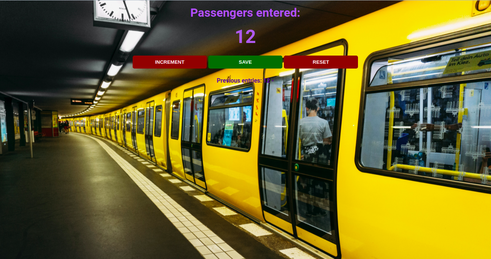

  <h3 align="center">Subway Passenger Counter App</h3>

  <p align="center">
    The app to get you started on counting passengers in a subway!
    <br />
  </p>
</p>


<!-- TABLE OF CONTENTS -->
<details open="open">
  <summary>Table of Contents</summary>
  <ol>
    <li>
      <a href="#about-the-project">About The Project</a>
      <ul>
        <li><a href="#built-with">Built With</a></li>
      </ul>
    </li>
    <li>
      <a href="#getting-started">Getting Started</a>
      <ul>
        <li><a href="#prerequisites">Prerequisites</a></li>
        <li><a href="#installation">Installation</a></li>
      </ul>
    </li>
    <li><a href="#usage">Usage</a></li>
    <li><a href="#license">License</a></li>
    <li><a href="#contact">Contact</a></li>
    <li><a href="#acknowledgements">Acknowledgements</a></li>
  </ol>
</details>


<!-- ABOUT THE PROJECT -->
## About The Project

<div style="text-align:center"></div>

Counting passengers in a subway can indeed be a daunting task sometimes, right? It also takes up a lot of time (and possibly, paper) if done on paper or manually on an electronic device.<br/>

The Subway Passenger Counter App was created as a solution to the above problem. The app simplifies the process of keeping track of the number of passengers in a subway, at a time, before the arrival of successive trains.

### Built With

These are the technologies that I used to build the Passenger Counter App:
* HTML5
* CSS3
* JavaScript


<!-- GETTING STARTED -->
## Getting Started

To get a local copy of the app, up and running on your system, follow these steps.

  ```

### Installation

1. Fork this repository
<div style="text-align:center"></div>

2. Clone the repository
   ```sh
   git clone https://github.com/theRangeCoder/passenger-counter.git
   ```
3. Navigate to the directory
   ```sh
   cd passenger-counter
   ```
4. Open the `index.html` file on your default browser or a browser of your choice
   ```sh
   xdg-open ./index.html
   ``` 


<!-- USAGE EXAMPLES -->
## Usage

Once you have successfully downloaded a local copy of the project and have opened it on your browser, you can use the `INCREMENT` button to increment the count, every time a new passenger comes in the subway.<br/>

The `SAVE` button can be used to save the passenger count, after the departure of each train.<br/>

The `RESET` button can be used to reset the number to 0, to enable a fresh counting of passengers, once a train departs from the station.

<div style="text-align:center"></div>


<!-- LICENSE -->
## License

Distributed under the MIT License. See `LICENSE` for more information.


<!-- CONTACT -->
## Contact

#### Shuvadarshan Bhual
* Drop me an [email](mailto:sbhual1998@gmail.com) 
* Follow me on [Twitter](https://twitter.com/theRangeCoder)
* Let us connect on [LinkedIn](www.linkedin.com/in/shuvadarshan-bhual)


<!-- ACKNOWLEDGEMENTS -->
## Acknowledgements
* [Othneil Drew](https://www.othneildrew.com) for the [README template](https://github.com/othneildrew/Best-README-Template)
* Background image by <a href="https://unsplash.com/@afs_snapshots?utm_source=unsplash&utm_medium=referral&utm_content=creditCopyText">Angel Santos</a> on <a href="https://unsplash.com/photos/-uN8tkM1JrM">Unsplash</a>

